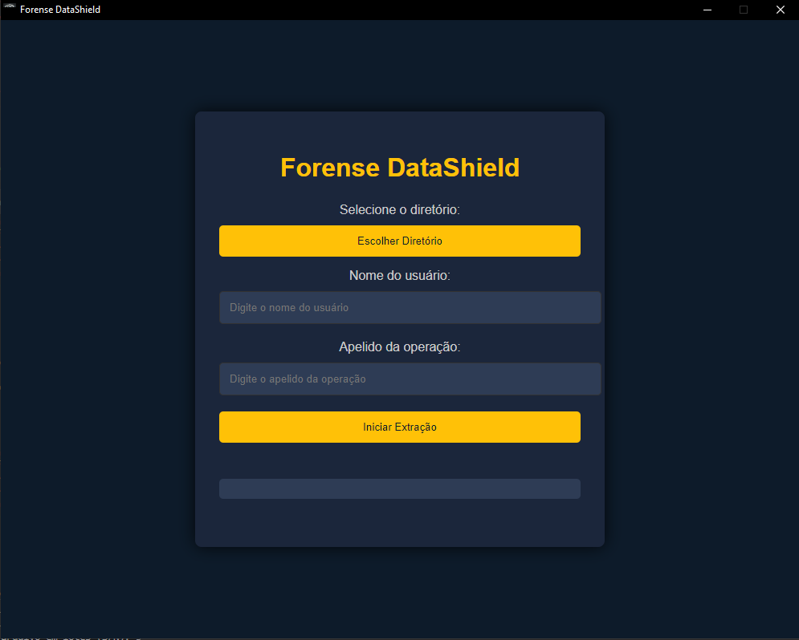

<!DOCTYPE html>
<html lang="pt-br">
<head>
  <meta charset="UTF-8">
  <meta name="viewport" content="width=device-width, initial-scale=1.0">
  <title>Forense DataShield - Ferramenta Forense</title>
  
</head>
<body>

  

    <h1>Forense DataShield</h1>
    
<strong>Versão:</strong> 1.1.0

    

    <h2>O que é o Forense DataShield?</h2>
    

      O <strong>Forense DataShield</strong> é uma ferramenta poderosa e de código aberto que permite a extração de dados digitais para fins forenses, ajudando a garantir a integridade da cadeia de custódia dos dados extraídos de dispositivos, como celulares e computadores. Nossa solução gera relatórios detalhados com hashes criptográficos e logs de operações, tornando-a indispensável para advogados, autoridades judiciais e investigadores.
    

    <h2>Por que isso é importante?</h2>
    

      Em um mundo cada vez mais digitalizado, a segurança de dados e a preservação da integridade das informações são cruciais. No Brasil, advogados e autoridades enfrentam desafios diários ao lidar com provas digitais e garantir que essas provas sejam aceitas em processos judiciais. O Forense DataShield oferece uma solução completa para esse problema.
    

    <h2>Quem pode se beneficiar?</h2>
    <ul>
      <li><strong>Advogados:</strong> Garante que as provas digitais sejam preservadas com integridade e possam ser apresentadas sem risco de adulteração.</li>
      <li><strong>Autoridades Policiais:</strong> Ferramenta essencial para a coleta de provas forenses, garantindo uma cadeia de custódia precisa e documentada.</li>
      <li><strong>Investigadores:</strong> Auxilia em investigações digitais, fornecendo uma maneira clara e transparente de registrar operações em dispositivos suspeitos.</li>
      <li><strong>Cidadãos:</strong> Para aqueles que precisam de uma ferramenta segura e confiável para a recuperação e preservação de dados digitais.</li>
    </ul>

    <h2>Funcionalidades Principais</h2>
    <ul>
      <li>Extração de dados telemáticos e criação de logs detalhados.</li>
      <li>Geração de hashes criptográficos para garantir a integridade dos arquivos extraídos.</li>
      <li>Relatórios completos para facilitar o trabalho de investigação.</li>
      <li>Suporte para navegação em subpastas e manutenção da estrutura de diretórios.</li>
      <li>Interface gráfica amigável, fácil de usar e totalmente executável (sem necessidade de Node.js instalado).</li>
    </ul>

    <h2>Como isso ajuda o Brasil?</h2>
    

      No Brasil, a necessidade de tecnologias seguras para a extração de dados em investigações está em alta. Com a crescente criminalidade digital, as autoridades precisam de ferramentas confiáveis e acessíveis. O Forense DataShield é uma ferramenta brasileira gratuita que promove a justiça ao garantir que as provas digitais sejam coletadas e armazenadas corretamente, facilitando processos judiciais justos e protegendo direitos tanto de vítimas quanto de acusados.
    

    <h2>Como começar?</h2>
    

      Para usar o Forense DataShield, basta baixar o instalador mais recente na nossa página de dist e seguir as instruções. Você pode conferir o código fonte e contribuir para o desenvolvimento diretamente no nosso repositório GitHub.
    

    <h2>Contribuições</h2>
    

      O Forense DataShield é um projeto de código aberto. Se você deseja contribuir, corrigir problemas ou sugerir novas funcionalidades, fique à vontade para fazer um fork do repositório e abrir um pull request.
    

    <h2>Licença</h2>
    

      Este projeto é licenciado sob a <a href="LICENSE">Licença MIT</a>, permitindo uso, modificação e distribuição.
    

  

</body>
</html>
